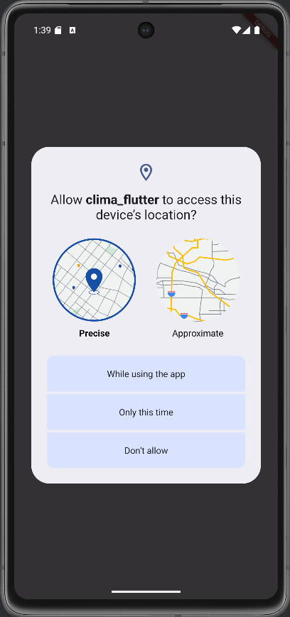
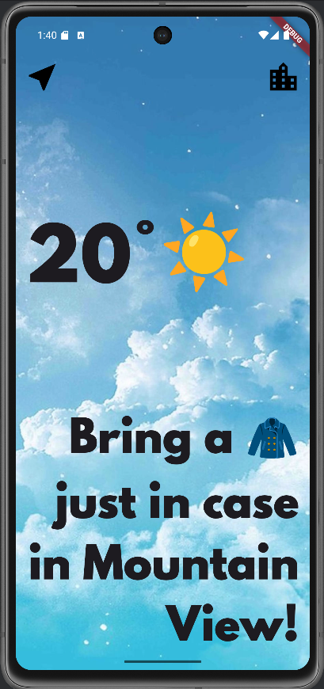
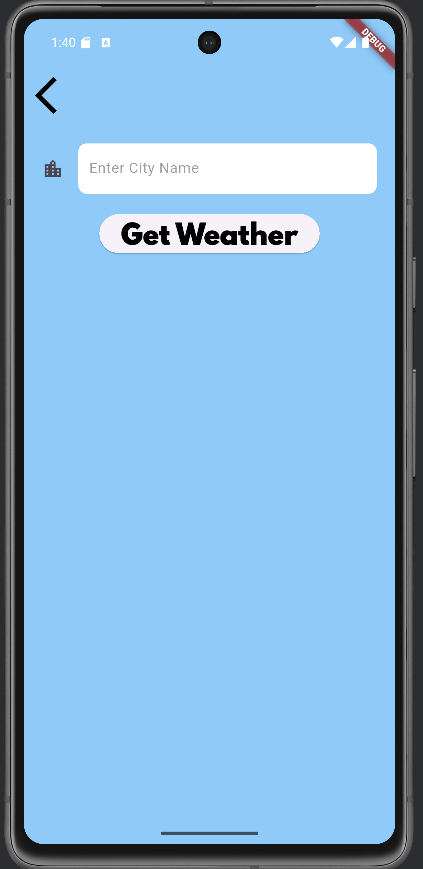

# Clima App - Aplicación de Pronóstico del Clima

---

## Descripción General

Clima App es una aplicación móvil desarrollada en Flutter que permite al usuario obtener información actual sobre el clima en su ubicación actual o en una ciudad específica. Utiliza la API de OpenWeatherMap para obtener datos de clima en tiempo real, mostrando la temperatura, las condiciones climáticas y recomendaciones según el clima. La aplicación ofrece una experiencia de usuario fluida con una interfaz gráfica atractiva y fácil de usar.

---

## 👁 Vista App
<p align="center">
  
  
  
</p>

---
## Funcionalidades Principales

- **Obtener clima de la ubicación actual**: La aplicación puede obtener automáticamente el clima de la ubicación actual del usuario mediante el uso de la geolocalización.
- **Buscar clima de una ciudad específica**: El usuario puede ingresar el nombre de una ciudad para obtener el pronóstico del clima en esa ubicación.
- **Mostrar íconos de condiciones climáticas**: Los íconos del clima son representados mediante emoticonos, como el sol, lluvia, nubes, etc., para representar diferentes condiciones climáticas.
- **Mensajes personalizados según la temperatura**: La aplicación muestra un mensaje basado en la temperatura actual.

---

## Requisitos del Proyecto

Para ejecutar esta aplicación, necesitas tener configurado lo siguiente:

- **Flutter SDK**: [Instalar Flutter](https://flutter.dev/docs/get-started/install)
- **Android Studio** o **Visual Studio Code**: Recomendado para desarrollar y ejecutar la aplicación en un emulador o dispositivo real.
- **Una clave API de OpenWeatherMap**: Necesaria para obtener los datos del clima. Puedes obtenerla registrándote en [OpenWeatherMap](https://openweathermap.org/api).

---

### 🛠️ Tecnologías Utilizadas / Paquetes Importados
- **Flutter**: El framework para el desarrollo de aplicaciones móviles.
- **http**: Paquete para realizar solicitudes HTTP a la API de OpenWeatherMap.
- **geolocator**: Paquete para obtener la ubicación actual del usuario mediante GPS.
- **flutter_spinkit**: Paquete para mostrar animaciones de carga mientras se obtiene el clima.

---

## 📁 Estructura del proyecto
```
fonts/
└── SpartanMB-Black.otf

images/ 
└── location_background.jpg

lib/
├── services/
│   ├── location.dart           # Clase para manejar la geolocalización del usuario
│   ├── networking.dart         # Clase para realizar las solicitudes HTTP a la API
│   └── weather.dart            # Clase para manejar los datos del clima y la lógica de los íconos
├── screens/
│   ├── city_screen.dart        # Pantalla para buscar el clima de una ciudad
│   ├── location_screen.dart    # Pantalla principal que muestra el clima actual
│   └── loading_screen.dart     # Pantalla de carga mientras se obtiene la información del clima
├── main.dart                   # Punto de entrada principal de la aplicación
└── utilities/
    └── constants.dart          # Archivo para almacenar las constantes globales (e.g., estilos)
```
---

## 👤 Autor

Desarrollado por **María José Mendieta Ortiz**   
🌐 https://github.com/MariaJoseMendieta
